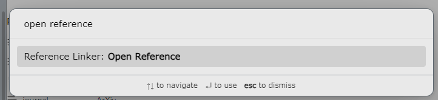

# Reference Linker: An Obsidian Plugin For Literature Review
> _Author_ Romain HERMARY <<romain.hermary@uni.lu>>


This plugin is designed to ease the management of scientific article references, notes taken on those papers, and links between them.

Import your highlights from a **PDF** (keeping the color), create a **MarkDown** file from a template to start taking notes, include citations to papers anywhere, all that automatically.

## Motivations

I wanted a way to construct a tree structure between my references, a bit like [**Docear**](https://docear.org/), but in a more complete and fresher way.

The only application I found that was suited for my needs was [**Obsidian**](https://obsidian.md/). Especially, the [*canvas*](https://obsidian.md/canvas) you can create in this application.

What was missing is a way for me to be able to link the notes taken on my **PDF** files, the notes I could have written, and the mind-maps/tree structures I designed to make sense of my literature review.

None of the current plugin in **Obsidian**'s community market place was gathering all I needed so I created my own, inspired by existing ones.

## Dependencies

- None for the **Obsidian** plugins, I reimplemented every part
- Your references imported in [**Zotero**](https://www.zotero.org/)
- [**ZotServer**](https://github.com/MunGell/ZotServer) for the **Zotero** connection


## Examples

## *settings*


## *(command)* Reference Linker: List References
> Create a note (or go to a note if it exists) related to a reference.

1. Chose the **Reference Linker: List References** command


2. Search for your reference in your **Zotero** library and select it


3. Once selected, the plugging will create a new note, with the *citekey* as name, and import the highlights from the **PDF** with name the *citekey*.


## *(command)* Reference Linker: Import Annotations
> Import annotations from an article at the end of the current note, if the note has *citekey* as a title.

1. *Note with correct name*


2. *Select command*


3. *PDF's highlights are imported*


## *(command)* Reference Linker: Cite Simple Reference
> Add a citation in a note, either made as a link to a note if it exists in the vault, or just insert the citekey if not.

1. *Select command*


2. *Select reference*


3. *Citation key is inserted*


## *(command)* Reference Linker: Update Screened References
> Go through the reference PDFs folder to check which ones have annotations. Notes will be created if new annotated PDFs (with a registered reference in **Zotero** ) are found; the ones that already have a linked note will have their *Annotations* section updated.
>
> /!\ As of now, the *Annotations* section is presumed to be the last section, and everything after it will be deleted when updating


## *template*
```
---
title: {{ title | remove([':']) }}
authors: {{ authors }}
year: {{ date | dateFormat("yyyy") }}
journal: {{ publicationTitle }}
citeKey: {{ citeKey }}
---

# {{title}}
```

# Better BibTeX Key

The generated citekeys have the equivalent of this [**Better BibTex**](https://retorque.re/zotero-better-bibtex/) format

```
auth(0, 1).capitalize + year + title.select(1, 1).capitalize +  title.abbr.select(2, 2).capitalize
```


# Links

As mentioned before, you might find some similar code parts as in those repositories:

- [Zotero Bridge](https://github.com/vanakat/zotero-bridge)
- [PDF Highlights](https://github.com/akaalias/obsidian-extract-pdf-highlights/tree/master)
- [Citations](https://github.com/hans/obsidian-citation-plugin/tree/master)
- [Extract PDF Annotations](https://github.com/munach/obsidian-extract-pdf-annotations)
- [Highlightr](https://github.com/chetachiezikeuzor/Highlightr-Plugin)
- [Templater](https://github.com/SilentVoid13/Templater)
- [Zotero Better BibTex](https://github.com/retorquere/zotero-better-bibtex/blob/master/content/key-manager/formatter.ts)

If you think I forgot some, please contact me so I can add it quickly.


# Notes

I developed this plugin using the [**DevContainers**](https://code.visualstudio.com/docs/devcontainers/containers) extension from **VSCode**; you can find my *very light* configuration under the `.devcontainer` folder, that way it will be easy to anyone to test/build this code.

I do not plan on maintaining this repository at a high frequency. I will just add the features I need throughout the time. Feel free to fork it and improve it yourself!